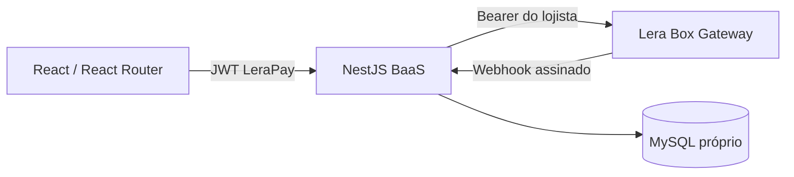

# Sugestões para a entrega — LeraPay BaaS

## Leitura geral

O projeto já está acima da média de um *take-home*: não se limita a telas e CRUD. A solução modela uma camada BaaS própria entre o frontend e o gateway, preserva estado local para reconciliação, usa um SDK tipado, trata valores em centavos e cobre checkout, carteira, saque e webhooks.

A principal oportunidade não é adicionar mais domínio: é reduzir a fricção de avaliação e provar confiabilidade em poucos minutos.

## Pontos fortes já implementados

- Fronteira clara: **React → API BaaS NestJS → Gateway Lera Box**, com MySQL próprio.
- SDK tipado `@lerapay/gateway-sdk`, evitando chamadas HTTP espalhadas pelo domínio.
- Separação entre JWT da aplicação e credenciais do gateway, sem expor token/senha do gateway ao browser.
- Persistência local de `checkout_links`, `orders`, `transactions`, `withdrawals` e `webhook_events`, com `externalReference` para reconciliação.
- Valores financeiros em inteiros de centavos e validação de taxa de cartão contra a tabela do gateway.
- Checkout público Pix/cartão, carteira, filtros de transação, saque e gestão de webhooks.
- Correlação de requisições e logs HTTP para rastreabilidade.
- Webhooks com auditoria e idempotência.

---

## Antes de entregar

### 1. Fechar segurança e invariantes do pagamento

**Esforço: baixo · Impacto para o avaliador: crítico**

Os pontos abaixo devem permanecer cobertos por regressão:

- Leituras de pagamento do lojista devem ser autenticadas e filtradas por `userId`, evitando IDOR entre contas.
- Polling público deve ser limitado ao par `checkoutLinkId` + `orderId`, expondo somente status mínimo da transação — não um endpoint global de pedido.
- O backend deve tratar o checkout como fonte de verdade: link ativo, não expirado, método permitido, valor fixo, referência de reconciliação e limite de parcelas.
- Se houver secret de webhook configurado, assinatura ausente ou inválida deve retornar erro.
- HMAC deve ser calculado sobre o **corpo bruto** recebido, nunca sobre `JSON.stringify(payload)`.
- `JWT_SECRET` não deve ter fallback conhecido; a aplicação deve falhar cedo diante de configuração inválida.

### 2. README orientado a avaliador

**Esforço: médio · Impacto para o avaliador: muito alto**

Substituir o README resumido por um runbook que permita avaliar o projeto em 10 minutos:

1. objetivo e arquitetura;
2. pré-requisitos e variáveis de ambiente;
3. setup exato, migrations e URLs de Web/API/Swagger/health;
4. fluxo de demonstração: cadastro → checkout → Pix/cartão → carteira → saque → webhook;
5. tabela `requisito do desafio → implementação`;
6. limitações do sandbox: aprovação/negação aleatória e necessidade de e-mail/telefone válidos;
7. estratégia para demonstrar callback local (túnel/URL pública);
8. trade-offs de produção e comandos de qualidade.

Um diagrama Mermaid simples já comunica bem a arquitetura:



### 3. Entrega limpa e reproduzível

**Esforço: baixo · Impacto para o avaliador: muito alto**

- Garantir `git status` limpo no commit final.
- Confirmar que nenhuma alteração unstaged ficou fora da entrega.
- Não versionar `.env`, tokens bearer, senhas de e-mail ou segredos de webhook.
- Validar em clone/worktree limpo, não só no ambiente de desenvolvimento.
- Enviar o SHA exato do commit final no handoff.
- Não depender de `.roadmap/` para explicar decisões: ela é ignorada pelo Git. Destilar o material importante para README/docs rastreados.

### 4. Docker completo ou comunicação honesta

**Esforço: médio · Impacto para o avaliador: alto**

O compose atual é útil para MySQL local, mas o diferencial do desafio é uma stack completa. O melhor pacote é:

- `Dockerfile` da API;
- `Dockerfile` do Web;
- `docker-compose.yml` com MySQL, API e Web;
- healthcheck e dependência da API em relação ao banco;
- portas e envs documentados;
- comportamento de migrations definido.

Se não estiver completamente validado, documentar explicitamente o compose como **MySQL para desenvolvimento local**, sem alegar containerização completa.

---

## Alto ROI

### 1. Testes focados nas fronteiras financeiras

**Esforço: médio · Impacto para o avaliador: muito alto**

Não é necessário uma suíte extensa. Priorizar testes unitários/de integração para:

- taxa divergente da tabela do gateway;
- cálculo em centavos e valor líquido;
- acesso cruzado entre lojistas;
- checkout expirado, inativo, com valor/método/parcelas inválidos;
- HMAC válido, inválido e ausente;
- idempotência de webhook;
- conciliação por `externalReference`.

Testes de regras irreversíveis valem mais que muitos snapshots visuais.

### 2. CI mínima no GitHub Actions

**Esforço: baixo · Impacto para o avaliador: alto**

Criar `.github/workflows/ci.yml` com Node e pnpm fixados, executando:

```sh
pnpm install --frozen-lockfile
pnpm format:check
pnpm lint
pnpm typecheck
pnpm build
pnpm test
```

Um workflow verde torna a qualidade verificável sem exigir confiança no autor.

### 3. Vídeo curto de demonstração

**Esforço: baixo · Impacto para o avaliador: alto**

Vídeo não listado de 2–4 minutos, com:

1. cadastro/login;
2. dashboard;
3. criação de checkout;
4. link público e QR Pix;
5. cartão com parcela/taxa;
6. carteira e filtros;
7. saque;
8. webhook, HMAC e atualização de status.

Explicar explicitamente que o sandbox pode aprovar ou negar operações aleatoriamente e que o webhook é a fonte de verdade para o estado final.

### 4. Credenciais e roteiro de demo seguros

**Esforço: baixo · Impacto para o avaliador: alto**

Oferecer conta de demonstração ou um roteiro claro de criação/reset. Nunca compartilhar senha do e-mail usado no gateway, token bearer ou segredo de webhook.

---

## Diferenciais úteis se houver tempo

| Iniciativa | Esforço | Impacto |
| --- | --- | --- |
| Compartilhar checkout via Web Share API/WhatsApp e copiar link | Baixo | Médio |
| Página imprimível de comprovante com referência, data, taxa e valor líquido | Baixo | Médio |
| Screenshots curados no README (dashboard, checkout, Pix, webhooks) | Baixo | Médio |
| Página 404 e detalhes de transação | Baixo–médio | Médio |
| Deploy HTTPS estável com Swagger e demo segura | Médio–alto | Alto |
| `helmet`, rate limit e CORS configurável por ambiente | Baixo–médio | Alto |
| Health check real de banco (`SELECT 1`) | Baixo | Médio |
| Criptografia de token de gateway em repouso | Médio | Alto |

Deploy público só é diferencial quando estiver estável; uma demo indisponível é pior que Docker funcional e vídeo claro.

---

## Evitar por enquanto

- Mais gráficos, analytics ou componentes visuais antes de testes, README e entrega limpa.
- Sistema completo de e-mail/WhatsApp com provedor real antes de fechar reprodutibilidade.
- Mock que esconda ou substitua a integração real com o gateway.
- PDF server-side complexo: a página imprimível já atende bem ao diferencial.
- Microsserviços, Kafka/RabbitMQ, antifraude próprio, multi-moeda ou multi-gateway: aumentam o risco sem melhorar proporcionalmente a avaliação deste desafio.

---

## Checklist de submissão

### Higiene

- [ ] Commit final contém todo o código necessário e o working tree está limpo.
- [ ] Nenhum segredo, token, senha ou `.env` foi versionado.
- [ ] README e documentação relevante são arquivos rastreados.

### Reprodutibilidade

- [ ] Setup funciona em clone limpo com Node `26.7.0` e pnpm `11.21.0`.
- [ ] Banco, migrations, API, Web e Swagger foram verificados.
- [ ] Variáveis de ambiente e comportamento de webhook local estão documentados.

### Qualidade

- [ ] `format:check`, lint, typecheck e build passam.
- [ ] Há testes para isolamento, taxa, centavos, checkout e webhook.
- [ ] CI executa a sequência de verificação.

### Demonstração

- [ ] Cadastro/login de lojista.
- [ ] Checkout Pix e cartão.
- [ ] Taxas/parcelas, carteira e filtros.
- [ ] Saque e seu ciclo de status.
- [ ] Webhook configurado e atualização assíncrona explicada.
- [ ] Vídeo, screenshots ou URL de demo incluídos somente quando confiáveis.

## Talking points para entrevista

- “O frontend inicia a intenção de pagamento; a API e o webhook confirmam o estado definitivo.”
- “Separei a identidade do BaaS da credencial do gateway para que o browser nunca veja o token do provedor.”
- “`externalReference` permite reconciliar checkout, pedido, transação e callback assíncrono.”
- “Taxas são obtidas/validadas no servidor e valores monetários são tratados em centavos.”
- “Webhooks são uma fronteira de segurança e confiabilidade: HMAC, idempotência e auditoria.”
